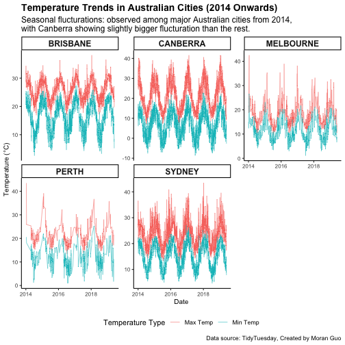
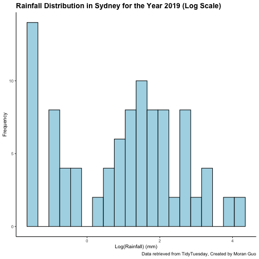
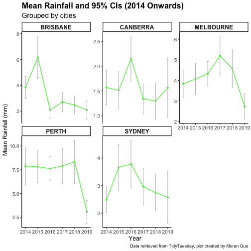

*This project, as the rest of the course, is adapted from the version [Stephanie C. Hicks](https://www.stephaniehicks.com/) designed and maintained in 2021 and 2022. Check the recent changes to this file through the [GitHub history](https://github.com/lcolladotor/jhustatcomputing/commits/main/raymond/JHSPH_Stat_Computing/index.qmd).*

# Background

**Due date: September 29th at 11:59pm**

The goal of this assignment is to practice designing and writing functions along with practicing our tidyverse skills that we learned in our previous project. Writing functions involves thinking about how code should be divided up and what the interface/arguments should be. In addition, you need to think about what the function will return as output.

### To submit your project

Please write up your project using R Markdown and processed with `knitr`. Compile your document as an **HTML file** and submit your HTML file to the dropbox on Courseplus. Please **show all your code** (i.e. make sure to set `echo = TRUE`) for each of the answers to each part.

### Install packages

Before attempting this assignment, you should first install the following packages, if they are not already installed:


``` r
install.packages("tidyverse")
install.packages("tidytuesdayR")
```

# Part 1: Fun with functions

In this part, we are going to practice creating functions.

### Part 1A: Exponential transformation

The exponential of a number can be written as an infinite series expansion of the form $$
\exp(x) = 1 + x + \frac{x^2}{2!} + \frac{x^3}{3!} + \cdots
$$ Of course, we cannot compute an infinite series by the end of this term and so we must truncate it at a certain point in the series. The truncated sum of terms represents an approximation to the true exponential, but the approximation may be usable.

Write a function that computes the exponential of a number using the truncated series expansion. The function should take two arguments:

-   `x`: the number to be exponentiated

-   `k`: the number of terms to be used in the series expansion beyond the constant 1. The value of `k` is always $\geq 1$.

For example, if $k = 1$, then the `Exp` function should return the number $1 + x$. If $k = 2$, then you should return the number $1 + x + x^2/2!$.

Include at least one example of output using your function.

::: callout-note
-   You can assume that the input value `x` will always be a *single* number.

-   You can assume that the value `k` will always be an integer $\geq 1$.

-   Do not use the `exp()` function in R.

-   The `factorial()` function can be used to compute factorials.
:::


``` r
Exp <- function(x, k) {
    output <- 1
    
    #term <- 1
    for (i in 0:k) {
        term <- 1
        term <- term * x^(i) / factorial(i)  
        output <- output + term 
        print(term)
    }
    
    return(output)
}
```

### Part 1B: Sample mean and sample standard deviation

Next, write two functions called `sample_mean()` and `sample_sd()` that takes as input a vector of data of length $N$ and calculates the sample average and sample standard deviation for the set of $N$ observations.

$$
\bar{x} = \frac{1}{N} \sum_{i=1}^n x_i
$$ $$
s = \sqrt{\frac{1}{N-1} \sum_{i=1}^N (x_i - \overline{x})^2}
$$ As a primer, the $\sum_{i = 1}^3 x_i$ is equivalent to doing the sum of $x_i$ starting from $i = 1$, increasing $i$ by 1 each then, up to when $i = 3$. That is, $x_1 + x_2 + x_3$.

Include at least one example of output using your functions.

::: callout-note
-   You can assume that the input value `x` will always be a *vector* of numbers of length *N*.

-   Do not use the `mean()` and `sd()` functions in R.
:::


``` r
sample_mean <- function(x) {
    n <- length(x)
    mean_val <- sum(x) / n
    
    return(mean_val)
}

sample_sd <- function(x) {
    n <- length(x)
    mean_val <- sample_mean(x)
    squared_div <- (x - mean_val)^2
    sd_val <- sqrt(sum(squared_div) / (n - 1))
    
    return(sd_val)
}
```

### Part 1C: Confidence intervals

Next, write a function called `calculate_CI()` that:

1.  There should be two inputs to the `calculate_CI()`. First, it should take as input a vector of data of length $N$. Second, the function should also have a `conf` ($=1-\alpha$) argument that allows the confidence interval to be adapted for different $\alpha$.

2.  Calculates a confidence interval (CI) (e.g. a 95% CI) for the estimate of the mean in the population. If you are not familiar with confidence intervals, it is an interval that contains the population parameter with probability $1-\alpha$ taking on this form

$$
\bar{x} \pm t_{\alpha/2, N-1} s_{\bar{x}}
= ( \bar{x} - t_{\alpha/2, N-1} s_{\bar{x}}, \bar{x} + t_{\alpha/2, N-1} s_{\bar{x}} )
$$

where $t_{\alpha/2, N-1}$ is the value needed to generate an area of $\alpha / 2$ in each tail of the $t$-distribution with $N-1$ degrees of freedom and $s_{\bar{x}} = \frac{s}{\sqrt{N}}$ is the standard error of the mean. For example, if we pick a 95% confidence interval and $N$=50, then you can calculate $t_{\alpha/2, N-1}$ as


``` r
alpha <- 1 - 0.95
degrees_freedom <- 50 - 1
t_score <- qt(p = alpha / 2, df = degrees_freedom, lower.tail = FALSE)
```

3.  Returns a named vector of length 2, where the first value is the `lower_bound`, the second value is the `upper_bound`.


``` r
calculate_CI <- function(x, conf = 0.95) {
    n <- length(x)
    mean_val <- sample_mean(x)
    sd_val <- sample_sd(x)
    
    standard_error <- sd_val / sqrt(n)
    
    alpha <- 1 - conf
    
    t_score <- qt(p = alpha / 2, df = n - 1, lower.tail = FALSE)
    
    me <- t_score * standard_error
    
    lower_bound <- mean_val - me
    upper_bound <- mean_val + me
    
    return(c(lower_bound = lower_bound, upper_bound = upper_bound))
}
```

Include example of output from your function showing the output when using two different levels of `conf`.

::: callout-note
If you want to check if your function output matches an existing function in R, consider a vector $x$ of length $N$ and see if the following two code chunks match.


``` r
calculate_CI(x, conf = 0.95)
```


``` r
dat <- data.frame(x = x)
fit <- lm(x ~ 1, dat)

# Calculate a 95% confidence interval
confint(fit, level = 0.95)
```
:::

# Part 2: Wrangling data

In this part, we will practice our wrangling skills with the tidyverse that we learned about in module 1.

### Data

The two datasets for this part of the assignment comes from [TidyTuesday](https://www.tidytuesday.com). Specifically, we will use the following data from January 2020, which I have provided for you below:


``` r
tuesdata <- tidytuesdayR::tt_load("2020-01-07")
rainfall <- tuesdata$rainfall
temperature <- tuesdata$temperature
```

However, to avoid re-downloading data, we will check to see if those files already exist using an `if()` statement:


``` r
library(here)
if (!file.exists(here("data", "tuesdata_rainfall.RDS"))) {
    tuesdata <- tidytuesdayR::tt_load("2020-01-07")
    rainfall <- tuesdata$rainfall
    temperature <- tuesdata$temperature

    # save the files to RDS objects
    saveRDS(tuesdata$rainfall, file = here("data", "tuesdata_rainfall.RDS"))
    saveRDS(tuesdata$temperature, file = here("data", "tuesdata_temperature.RDS"))
}
```

::: callout-note
The above code will only run if it cannot find the path to the `tuesdata_rainfall.RDS` on your computer. Then, we can just read in these files every time we knit the R Markdown, instead of re-downloading them every time.
:::

Let's load the datasets


``` r
rainfall <- readRDS(here("data", "tuesdata_rainfall.RDS"))
temperature <- readRDS(here("data", "tuesdata_temperature.RDS"))
```

Now we can look at the data with `glimpse()`


``` r
library(tidyverse)

glimpse(rainfall)
```

```
## Rows: 179,273
## Columns: 11
## $ station_code <chr> "009151", "009151", "009151", "009151", "009151", "009151", "009151", "009151", "009151", "009151…
## $ city_name    <chr> "Perth", "Perth", "Perth", "Perth", "Perth", "Perth", "Perth", "Perth", "Perth", "Perth", "Perth"…
## $ year         <dbl> 1967, 1967, 1967, 1967, 1967, 1967, 1967, 1967, 1967, 1967, 1967, 1967, 1967, 1967, 1967, 1967, 1…
## $ month        <chr> "01", "01", "01", "01", "01", "01", "01", "01", "01", "01", "01", "01", "01", "01", "01", "01", "…
## $ day          <chr> "01", "02", "03", "04", "05", "06", "07", "08", "09", "10", "11", "12", "13", "14", "15", "16", "…
## $ rainfall     <dbl> NA, NA, NA, NA, NA, NA, NA, NA, NA, NA, NA, NA, NA, NA, NA, NA, NA, NA, NA, NA, NA, NA, NA, NA, N…
## $ period       <dbl> NA, NA, NA, NA, NA, NA, NA, NA, NA, NA, NA, NA, NA, NA, NA, NA, NA, NA, NA, NA, NA, NA, NA, NA, N…
## $ quality      <chr> NA, NA, NA, NA, NA, NA, NA, NA, NA, NA, NA, NA, NA, NA, NA, NA, NA, NA, NA, NA, NA, NA, NA, NA, N…
## $ lat          <dbl> -31.96, -31.96, -31.96, -31.96, -31.96, -31.96, -31.96, -31.96, -31.96, -31.96, -31.96, -31.96, -…
## $ long         <dbl> 115.79, 115.79, 115.79, 115.79, 115.79, 115.79, 115.79, 115.79, 115.79, 115.79, 115.79, 115.79, 1…
## $ station_name <chr> "Subiaco Wastewater Treatment Plant", "Subiaco Wastewater Treatment Plant", "Subiaco Wastewater T…
```

``` r
glimpse(temperature)
```

```
## Rows: 528,278
## Columns: 5
## $ city_name   <chr> "PERTH", "PERTH", "PERTH", "PERTH", "PERTH", "PERTH", "PERTH", "PERTH", "PERTH", "PERTH", "PERTH",…
## $ date        <date> 1910-01-01, 1910-01-02, 1910-01-03, 1910-01-04, 1910-01-05, 1910-01-06, 1910-01-07, 1910-01-08, 1…
## $ temperature <dbl> 26.7, 27.0, 27.5, 24.0, 24.8, 24.4, 25.3, 28.0, 32.6, 35.9, 33.9, 38.6, 35.1, 32.9, 30.3, 25.8, 25…
## $ temp_type   <chr> "max", "max", "max", "max", "max", "max", "max", "max", "max", "max", "max", "max", "max", "max", …
## $ site_name   <chr> "PERTH AIRPORT", "PERTH AIRPORT", "PERTH AIRPORT", "PERTH AIRPORT", "PERTH AIRPORT", "PERTH AIRPOR…
```

If we look at the [TidyTuesday github repo](https://github.com/rfordatascience/tidytuesday/tree/master/data/2020#2020-data) from 2020, we see this dataset contains temperature and rainfall data from Australia.

Here is a data dictionary for what all the column names mean:

-   <https://github.com/rfordatascience/tidytuesday/blob/master/data/2020/2020-01-07/readme.md#data-dictionary>

### Tasks

Using the `rainfall` and `temperature` data, perform the following steps and create a new data frame called `df`:

1.  Start with `rainfall` dataset and drop any rows with NAs.
2.  Create a new column titled `date` that combines the columns `year`, `month`, `day` into one column separated by "-". (e.g. "2020-01-01"). This column should not be a character, but should be recognized as a date. (**Hint**: check out the `ymd()` function in `lubridate` R package). You will also want to add a column that just keeps the `year`.
3.  Using the `city_name` column, convert the city names (character strings) to all upper case.
4.  Join this wrangled rainfall dataset with the `temperature` dataset such that it includes only observations that are in both data frames. (**Hint**: there are two keys that you will need to join the two datasets together). (**Hint**: If all has gone well thus far, you should have a dataset with 83,964 rows and 13 columns).

::: callout-note
-   You may need to use functions outside these packages to obtain this result, in particular you may find the functions `drop_na()` from `tidyr` and `str_to_upper()` function from `stringr` useful.
:::


``` r
# Load required packages
library(tidyverse)
library(lubridate)

rainfall_cleaned <- rainfall %>%
  drop_na() %>%
  mutate(date = ymd(paste(year, month, day, sep = '-')),
         year = year,
         city_name = str_to_upper(city_name)) %>%
  select(-month, -day)

df <- rainfall_cleaned %>% inner_join(temperature, by = c("city_name", "date"))
```

```
## Warning in inner_join(., temperature, by = c("city_name", "date")): Detected an unexpected many-to-many relationship between `x` and `y`.
## ℹ Row 1 of `x` matches multiple rows in `y`.
## ℹ Row 138722 of `y` matches multiple rows in `x`.
## ℹ If a many-to-many relationship is expected, set `relationship = "many-to-many"` to silence this warning.
```

``` r
glimpse(df) # The size is correct, 83964 columns and 13 rows
```

```
## Rows: 83,964
## Columns: 13
## $ station_code <chr> "009151", "009151", "009151", "009151", "009151", "009151", "009151", "009151", "009151", "009151…
## $ city_name    <chr> "PERTH", "PERTH", "PERTH", "PERTH", "PERTH", "PERTH", "PERTH", "PERTH", "PERTH", "PERTH", "PERTH"…
## $ year         <dbl> 1967, 1967, 1967, 1967, 1967, 1967, 1967, 1967, 1967, 1967, 1967, 1967, 1967, 1967, 1967, 1967, 1…
## $ rainfall     <dbl> 2.8, 2.8, 4.8, 4.8, 5.8, 5.8, 16.0, 16.0, 1.0, 1.0, 1.0, 1.0, 15.5, 15.5, 8.6, 8.6, 12.2, 12.2, 6…
## $ period       <dbl> 1, 1, 1, 1, 1, 1, 1, 1, 1, 1, 1, 1, 1, 1, 1, 1, 1, 1, 1, 1, 1, 1, 1, 1, 1, 1, 1, 1, 1, 1, 1, 1, 1…
## $ quality      <chr> "Y", "Y", "Y", "Y", "Y", "Y", "Y", "Y", "Y", "Y", "Y", "Y", "Y", "Y", "Y", "Y", "Y", "Y", "Y", "Y…
## $ lat          <dbl> -31.96, -31.96, -31.96, -31.96, -31.96, -31.96, -31.96, -31.96, -31.96, -31.96, -31.96, -31.96, -…
## $ long         <dbl> 115.79, 115.79, 115.79, 115.79, 115.79, 115.79, 115.79, 115.79, 115.79, 115.79, 115.79, 115.79, 1…
## $ station_name <chr> "Subiaco Wastewater Treatment Plant", "Subiaco Wastewater Treatment Plant", "Subiaco Wastewater T…
## $ date         <date> 1967-07-05, 1967-07-05, 1967-07-06, 1967-07-06, 1967-07-07, 1967-07-07, 1967-07-10, 1967-07-10, …
## $ temperature  <dbl> 17.8, 8.7, 18.4, 8.0, 17.2, 10.5, 16.1, 4.4, 16.8, 4.1, 21.3, 11.5, 15.0, 11.7, 16.6, 8.5, 15.6, …
## $ temp_type    <chr> "max", "min", "max", "min", "max", "min", "max", "min", "max", "min", "max", "min", "max", "min",…
## $ site_name    <chr> "PERTH AIRPORT", "PERTH AIRPORT", "PERTH AIRPORT", "PERTH AIRPORT", "PERTH AIRPORT", "PERTH AIRPO…
```

# Part 3: Data visualization

In this part, we will practice our `ggplot2` plotting skills within the tidyverse starting with our wrangled `df` data from Part 2. For full credit in this part (and for all plots that you make), your plots should include:

1.  An overall title for the plot and a subtitle summarizing key trends that you found. Also include a caption in the figure.
2.  There should be an informative x-axis and y-axis label.

Consider playing around with the `theme()` function to make the figure shine, including playing with background colors, font, etc.

### Part 3A: Plotting temperature data over time

Use the functions in `ggplot2` package to make a line plot of the max and min temperature (y-axis) over time (x-axis) for each city in our wrangled data from Part 2. You should only consider years 2014 and onwards. For full credit, your plot should include:

1.  For a given city, the min and max temperature should both appear on the plot, but they should be two different colors.
2.  Use a facet function to facet by `city_name` to show all cities in one figure.


``` r
# Load required package
library(ggplot2)

df_min_max_temps <- df %>% 
  group_by(city_name, date) %>%
  summarise(
    max_temp = max(temperature, na.rm = TRUE),
    min_temp = min(temperature, na.rm = TRUE)
  ) %>%
  ungroup()
```

```
## Warning: There were 12 warnings in `summarise()`.
## The first warning was:
## ℹ In argument: `max_temp = max(temperature, na.rm = TRUE)`.
## ℹ In group 22103: `city_name = "PERTH"` and `date = 2008-09-19`.
## Caused by warning in `max()`:
## ! no non-missing arguments to max; returning -Inf
## ℹ Run `dplyr::last_dplyr_warnings()` to see the 11 remaining warnings.
```

```
## `summarise()` has grouped output by 'city_name'. You can override using the `.groups` argument.
```

``` r
df_filtered <- df_min_max_temps %>%
  filter(year(date) >= 2014)

ggplot(df_filtered, aes(x = date)) +
    geom_line(aes(y = max_temp, color = "Max Temp"), size = 0.25) +
    geom_line(aes(y = min_temp, color = "Min Temp"), size = 0.25) +
    facet_wrap(~ city_name, scales = "free_y") +
    labs(
        title = "Temperature Trends in Australian Cities (2014 Onwards)",
        subtitle = "Seasonal flucturations: observed among major Australian cities from 2014,\nwith Canberra showing slightly bigger flucturation than the rest.",
        x = "Date",
        y = "Temperature (°C)",
        color = "Temperature Type",
        caption = "Data source: TidyTuesday, Created by Moran Guo"
    ) +
    theme_classic() +
    theme(
        plot.title = element_text(face = "bold", size = 14),
        plot.subtitle = element_text(size = 12),
        axis.title = element_text(size = 10),
        axis.text = element_text(size = 8),
        legend.position = "bottom",
        strip.text = element_text(face = "bold", size = 12)
    )
```



### Part 3B: Plotting rainfall over time

Here we want to explore the distribution of rainfall (log scale) with histograms for a given city (indicated by the `city_name` column) for a given year (indicated by the `year` column) so we can make some exploratory plots of the data.

::: callout-note
You are again using the wrangled data from Part 2.
:::

The following code plots the data from one city (`city_name == "PERTH"`) in a given year (`year == 2000`).


``` r
df %>%
    filter(city_name == "PERTH", year == 2000) %>%
    ggplot(aes(log(rainfall))) +
    geom_histogram()
```

While this code is useful, it only provides us information on one city in one year. We could cut and paste this code to look at other cities/years, but that can be error prone and just plain messy.

The aim here is to **design** and **implement** a function that can be re-used to visualize all of the data in this dataset.

1.  There are 2 aspects that may vary in the dataset: The **city_name** and the **year**. Note that not all combinations of `city_name` and `year` have measurements.

2.  Your function should take as input two arguments **city_name** and **year**.

3.  Given the input from the user, your function should return a **single** histogram for that input. Furthermore, the data should be **readable** on that plot so that it is in fact useful. It should be possible visualize the entire dataset with your function (through repeated calls to your function).

4.  If the user enters an input that does not exist in the dataset, your function should catch that and report an error (via the `stop()` function).

For this section,

1.  Write a short description of how you chose to design your function and why.

2.  Present the code for your function in the R markdown document.

3.  Include at least one example of output from your function.


``` r
rainfall_histogram <- function(name, Year){
  filtered_data <- df %>%
    filter(city_name == toupper(name), year == Year)
  print(filtered_data)
  if (nrow(filtered_data) == 0){
    stop(paste("There is no data available for", name, "in the year", Year))
  }
  
  ggplot(filtered_data, aes(x = log(rainfall))) +
    geom_histogram(binwidth = 0.3, fill = "lightblue", color = "black") + 
    labs(
      title = paste("Rainfall Distribution in", name, "for the Year", Year, "(Log Scale)"),
      x = "Log(Rainfall) (mm)",
      y = "Frequency",
      caption = "Data retrieved from TidyTuesday, Created by Moran Guo"
    ) +
    theme_classic() +
    theme(
      plot.title = element_text(face = "bold", size = 14),
      axis.title = element_text(size = 10),
      axis.text = element_text(size = 8)
    )
}
```


``` r
rainfall_histogram("Sydney", 2019)
```

```
## # A tibble: 302 × 13
##    station_code city_name  year rainfall period quality   lat  long station_name     date       temperature temp_type
##    <chr>        <chr>     <dbl>    <dbl>  <dbl> <chr>   <dbl> <dbl> <chr>            <date>           <dbl> <chr>    
##  1 066062       SYDNEY     2019      8.8      1 N       -33.9  151. Observatory Hill 2019-01-01        31.6 max      
##  2 066062       SYDNEY     2019      8.8      1 N       -33.9  151. Observatory Hill 2019-01-01        21.7 min      
##  3 066062       SYDNEY     2019      0        1 N       -33.9  151. Observatory Hill 2019-01-02        29.8 max      
##  4 066062       SYDNEY     2019      0        1 N       -33.9  151. Observatory Hill 2019-01-02        21.4 min      
##  5 066062       SYDNEY     2019      0        1 N       -33.9  151. Observatory Hill 2019-01-03        28.8 max      
##  6 066062       SYDNEY     2019      0        1 N       -33.9  151. Observatory Hill 2019-01-03        21.4 min      
##  7 066062       SYDNEY     2019      0        1 N       -33.9  151. Observatory Hill 2019-01-04        32.2 max      
##  8 066062       SYDNEY     2019      0        1 N       -33.9  151. Observatory Hill 2019-01-04        20.9 min      
##  9 066062       SYDNEY     2019      0        1 N       -33.9  151. Observatory Hill 2019-01-05        37.8 max      
## 10 066062       SYDNEY     2019      0        1 N       -33.9  151. Observatory Hill 2019-01-05        22.6 min      
## # ℹ 292 more rows
## # ℹ 1 more variable: site_name <chr>
```

```
## Warning: Removed 206 rows containing non-finite outside the scale range (`stat_bin()`).
```



# Part 4: Apply functions and plot

### Part 4A: Tasks

In this part, we will apply the functions we wrote in Part 1 to our rainfall data starting with our wrangled `df` data from Part 2.

1.  First, filter for only years including 2014 and onwards.
2.  For a given city and for a given year, calculate the sample mean (using your function `sample_mean()`), the sample standard deviation (using your function `sample_sd()`), and a 95% confidence interval for the average rainfall (using your function `calculate_CI()`). Specifically, you should add two columns in this summarized dataset: a column titled `lower_bound` and a column titled `upper_bound` containing the lower and upper bounds for you CI that you calculated (using your function `calculate_CI()`).
3.  Call this summarized dataset `rain_df`.


``` r
filtered_df <- df %>%
  filter(year >= 2014)

rain_df <- filtered_df %>%
  group_by(city_name, year) %>%
  summarise(
    mean_rainfall = sample_mean(rainfall),
    sd_rainfall = sample_sd(rainfall),
    lower_bound = calculate_CI(rainfall, conf = 0.95)[1],
    upper_bound = calculate_CI(rainfall, conf = 0.95)[2]
  ) %>%
  ungroup()
```

```
## `summarise()` has grouped output by 'city_name'. You can override using the `.groups` argument.
```

### Part 4B: Tasks

Using the `rain_df`, plots the estimates of mean rainfall and the 95% confidence intervals on the same plot. There should be a separate faceted plot for each city. Think about using `ggplot()` with both `geom_point()` (and `geom_line()` to connect the points) for the means and `geom_errorbar()` for the lower and upper bounds of the confidence interval. Check <https://r-graphics.org/recipe-annotate-error-bar> and or the official documentation <https://ggplot2.tidyverse.org/reference/geom_linerange.html> for examples of how to use `geom_errorbar()`.


``` r
# Load required packages
library(ggplot2)

ggplot(rain_df, aes(x = year, y = mean_rainfall)) +
  geom_point(size = 1, color = "green") +  # Points for mean rainfall
  geom_line(color = "green") +  # Line connecting the points
  geom_errorbar(aes(ymin = lower_bound, ymax = upper_bound), width = 0.1, color = "grey") +  # Error bars for CI
  facet_wrap(~ city_name, scales = "free_y") +  # Facet by city
  labs(
    title = "Mean Rainfall and 95% CIs (2014 Onwards)",
    subtitle = "Grouped by cities",
    x = "Year",
    y = "Mean Rainfall (mm)",
    caption = "Data retrieved from TidyTuesday, plot created by Moran Guo"
  ) +
  theme_classic() +
  theme(
    plot.title = element_text(face = "bold", size = 16),
    plot.subtitle = element_text(size = 14),
    axis.title = element_text(size = 12),
    axis.text = element_text(size = 10),
    strip.text = element_text(face = "bold", size = 12)
  )
```



# R session information


``` r
options(width = 120)
sessioninfo::session_info()
```

```
## ─ Session info ───────────────────────────────────────────────────────────────────────────────────────────────────────
##  setting  value
##  version  R version 4.4.1 (2024-06-14)
##  os       macOS 15.0
##  system   aarch64, darwin20
##  ui       RStudio
##  language (EN)
##  collate  en_US.UTF-8
##  ctype    en_US.UTF-8
##  tz       America/New_York
##  date     2024-09-25
##  rstudio  2024.04.2+764 Chocolate Cosmos (desktop)
##  pandoc   NA
## 
## ─ Packages ───────────────────────────────────────────────────────────────────────────────────────────────────────────
##  package      * version date (UTC) lib source
##  bit            4.0.5   2022-11-15 [2] CRAN (R 4.4.0)
##  bit64          4.0.5   2020-08-30 [2] CRAN (R 4.4.0)
##  cli            3.6.3   2024-06-21 [2] CRAN (R 4.4.0)
##  colorspace     2.1-1   2024-07-26 [2] CRAN (R 4.4.0)
##  crayon         1.5.3   2024-06-20 [2] CRAN (R 4.4.0)
##  curl           5.2.2   2024-08-26 [2] CRAN (R 4.4.1)
##  dplyr        * 1.1.4   2023-11-17 [2] CRAN (R 4.4.0)
##  evaluate       0.24.0  2024-06-10 [2] CRAN (R 4.4.0)
##  fansi          1.0.6   2023-12-08 [2] CRAN (R 4.4.0)
##  farver         2.1.2   2024-05-13 [2] CRAN (R 4.4.0)
##  forcats      * 1.0.0   2023-01-29 [2] CRAN (R 4.4.0)
##  generics       0.1.3   2022-07-05 [2] CRAN (R 4.4.0)
##  ggplot2      * 3.5.1   2024-04-23 [2] CRAN (R 4.4.0)
##  gh             1.4.1   2024-03-28 [2] CRAN (R 4.4.0)
##  gitcreds       0.1.2   2022-09-08 [1] CRAN (R 4.4.0)
##  glue           1.7.0   2024-01-09 [2] CRAN (R 4.4.0)
##  gtable         0.3.5   2024-04-22 [2] CRAN (R 4.4.0)
##  here         * 1.0.1   2020-12-13 [2] CRAN (R 4.4.0)
##  highr          0.11    2024-05-26 [2] CRAN (R 4.4.0)
##  hms            1.1.3   2023-03-21 [2] CRAN (R 4.4.0)
##  httr2          1.0.3   2024-08-22 [2] CRAN (R 4.4.1)
##  jsonlite       1.8.8   2023-12-04 [2] CRAN (R 4.4.0)
##  knitr          1.48    2024-07-07 [2] CRAN (R 4.4.0)
##  labeling       0.4.3   2023-08-29 [2] CRAN (R 4.4.0)
##  lifecycle      1.0.4   2023-11-07 [2] CRAN (R 4.4.0)
##  lubridate    * 1.9.3   2023-09-27 [2] CRAN (R 4.4.0)
##  magrittr       2.0.3   2022-03-30 [2] CRAN (R 4.4.0)
##  munsell        0.5.1   2024-04-01 [2] CRAN (R 4.4.0)
##  pillar         1.9.0   2023-03-22 [2] CRAN (R 4.4.0)
##  pkgconfig      2.0.3   2019-09-22 [2] CRAN (R 4.4.0)
##  purrr        * 1.0.2   2023-08-10 [2] CRAN (R 4.4.0)
##  R6             2.5.1   2021-08-19 [2] CRAN (R 4.4.0)
##  rappdirs       0.3.3   2021-01-31 [2] CRAN (R 4.4.0)
##  readr        * 2.1.5   2024-01-10 [2] CRAN (R 4.4.0)
##  rlang          1.1.4   2024-06-04 [2] CRAN (R 4.4.0)
##  rprojroot      2.0.4   2023-11-05 [2] CRAN (R 4.4.0)
##  rstudioapi     0.16.0  2024-03-24 [2] CRAN (R 4.4.0)
##  scales         1.3.0   2023-11-28 [2] CRAN (R 4.4.0)
##  sessioninfo    1.2.2   2021-12-06 [2] CRAN (R 4.4.0)
##  stringi        1.8.4   2024-05-06 [2] CRAN (R 4.4.0)
##  stringr      * 1.5.1   2023-11-14 [2] CRAN (R 4.4.0)
##  tibble       * 3.2.1   2023-03-20 [2] CRAN (R 4.4.0)
##  tidyr        * 1.3.1   2024-01-24 [2] CRAN (R 4.4.0)
##  tidyselect     1.2.1   2024-03-11 [2] CRAN (R 4.4.0)
##  tidytuesdayR   1.1.2   2024-09-09 [1] CRAN (R 4.4.1)
##  tidyverse    * 2.0.0   2023-02-22 [1] CRAN (R 4.4.0)
##  timechange     0.3.0   2024-01-18 [2] CRAN (R 4.4.0)
##  tzdb           0.4.0   2023-05-12 [2] CRAN (R 4.4.0)
##  utf8           1.2.4   2023-10-22 [2] CRAN (R 4.4.0)
##  vctrs          0.6.5   2023-12-01 [2] CRAN (R 4.4.0)
##  vroom          1.6.5   2023-12-05 [2] CRAN (R 4.4.0)
##  withr          3.0.1   2024-07-31 [2] CRAN (R 4.4.0)
##  xfun           0.47    2024-08-17 [2] CRAN (R 4.4.0)
##  xml2           1.3.6   2023-12-04 [2] CRAN (R 4.4.0)
##  yaml           2.3.10  2024-07-26 [2] CRAN (R 4.4.0)
## 
##  [1] /Users/raymond/Library/R/arm64/4.4/library
##  [2] /Library/Frameworks/R.framework/Versions/4.4-arm64/Resources/library
## 
## ──────────────────────────────────────────────────────────────────────────────────────────────────────────────────────
```
